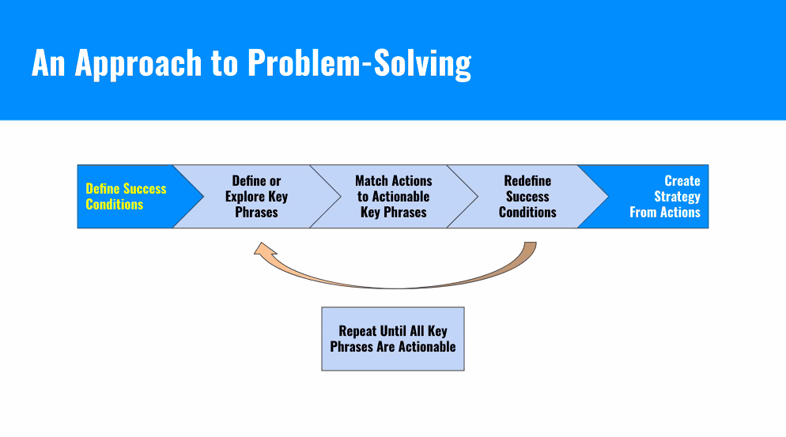
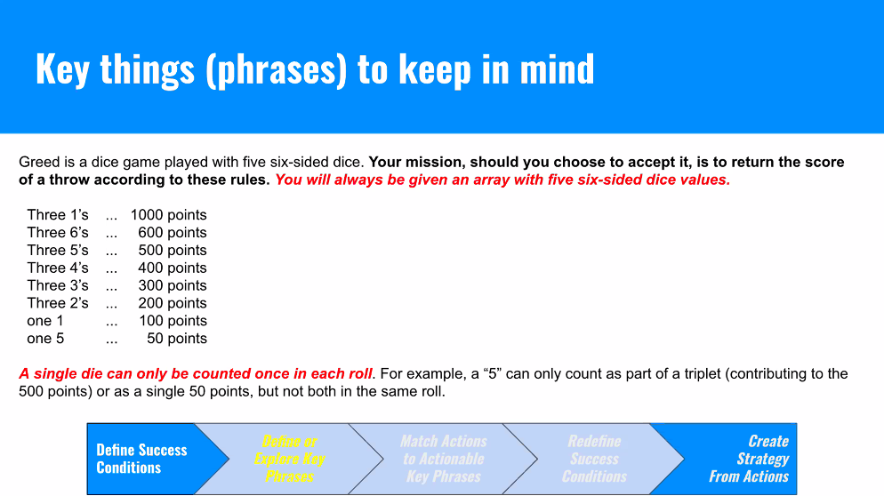
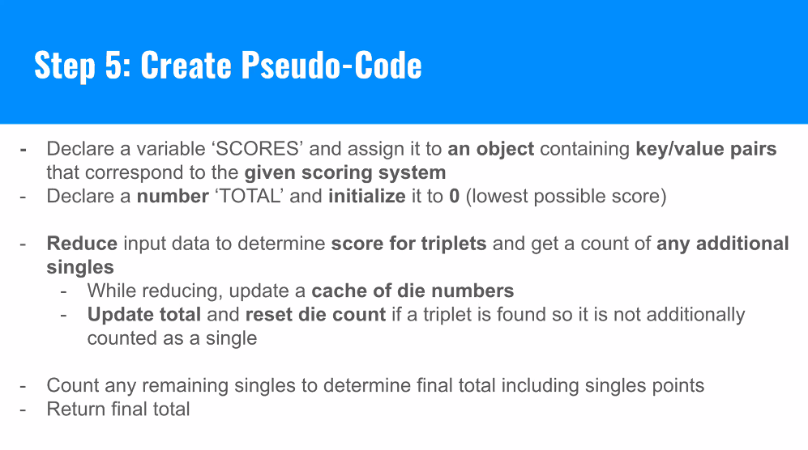

# Approach to problem solving



### Define your success conditions

What's expected of us, and what will our rough output be?

### Define and explore phrases

What is the shape of the data, and inputs? What information is critical to solving the problem?

### Match actions to the phrases

Look for key phrases in the instructions that are actionable. In other words, any inforamtion that could help us construct a path forward

### Redefine our success conditions

Did we miss anything? Is there an edge case? Does this new information change our original success condition?

### Create our strategy from the actions

Write a set of instructions. First, pseudocode. Then the actual code.

# Example: Greed is Good

1. Our output will be the best possible score. Input will be an array of five elements, with six possible values each.
2. Here are some key phrases



3. Strategy: We'll want to keep track of the numbers (perhaps an object). We'll also need conditional logic for keeping track of score.

- 6,6,4,4,3 ––> Returns 0. No triplets or singles.
- 1,1,1,1,2 ––> Returns 1100. One triplet scored. Extra one scored as well.
- 5,5,5,3,2 ––> Returns 500 points.
- 1,2,3,4,5 ––> Returns 150 points. Two singles counted.



## Final solution:

```js
const refactoredGreed = (dice) => {
  const possiblePoints = {
    111: 1000,
    666: 600,
    555: 500,
    444: 400,
    333: 300,
    222: 200,
    1: 100,
    5: 50,
  };

  let total = 0;

  const singlesCount = dice.reduce((singlesCache, die) => {
    if (!singlesCache[die]) singlesCache[die] = 0;
    singlesCache[die]++;

    if (singlesCache[die] === 3) {
      total += possiblePoints[`${die}${die}${die}`];
      delete singlesCache[die];
    }
    return singlesCache;
  }, {});

  Object.keys(singlesCount).forEach((die) => {
    if (possiblePoints[die]) total += possiblePoints[die] * singlesCount[die];
  });
  return total;
};

console.log(refactoredGreed([1, 1, 1, 1, 6]));
```
